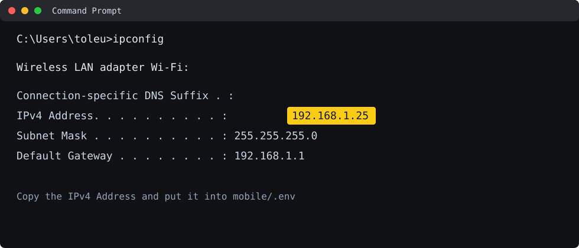
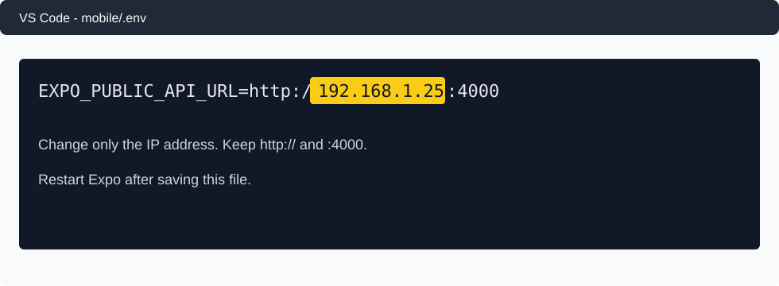
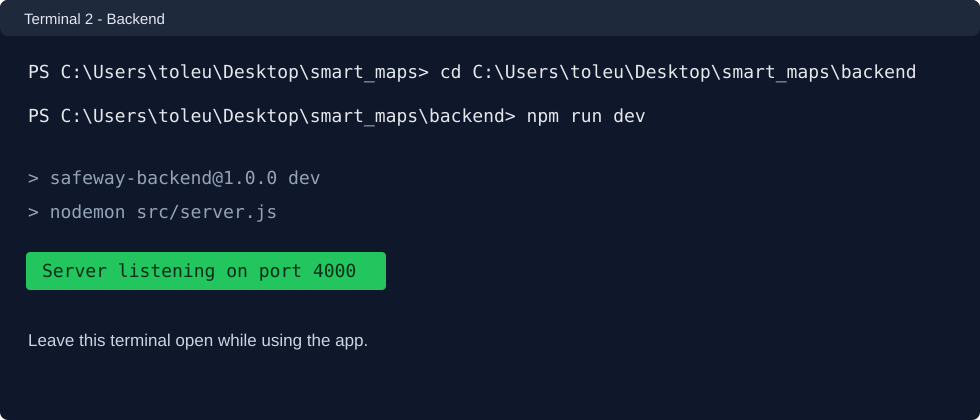
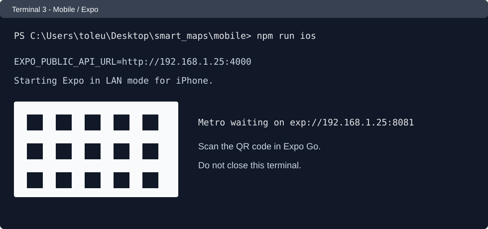

# Инструкция по запуску SafeWay

Эта инструкция показывает простой запуск проекта на Windows: сначала узнаём IP компьютера, потом меняем IP в `mobile/.env`, затем запускаем базу данных, backend и мобильное приложение в отдельных терминалах.

## 1. Откройте командную строку и посмотрите IP

1. Нажмите `Win + R`.
2. Введите:

```text
cmd
```

3. Нажмите `Enter`.
4. В открывшейся командной строке введите:

```bat
ipconfig
```

5. Найдите активный адаптер Wi-Fi или Ethernet и строку `IPv4 Address`.

Ориентир на экране:



```text
Wireless LAN adapter Wi-Fi:

   IPv4 Address. . . . . . . . . . . : 192.168.1.25
   Subnet Mask . . . . . . . . . . . : 255.255.255.0
   Default Gateway . . . . . . . . . : 192.168.1.1
```

В этом примере IP компьютера:

```text
192.168.1.25
```

У вас IP может быть другим. Скопируйте именно свой `IPv4 Address`.

## 2. Поменяйте IP в `mobile/.env`

Откройте файл:

```text
mobile/.env
```

Сейчас там строка выглядит примерно так:

```env
EXPO_PUBLIC_API_URL=http://10.166.109.151:4000
```

Замените IP на тот, который нашли через `ipconfig`.

Пример, если ваш IP `192.168.1.25`:

```env
EXPO_PUBLIC_API_URL=http://192.168.1.25:4000
```

Важно:

- `http://` оставляем.
- `:4000` оставляем.
- Меняем только IP между `http://` и `:4000`.
- Телефон и компьютер должны быть подключены к одной Wi-Fi сети.

Ориентир как должно быть:



```text
mobile/.env

EXPO_PUBLIC_API_URL=http://ВАШ_IP:4000
```

## 3. Запустите базу данных

Откройте новый терминал в VS Code:

1. Откройте проект `smart_maps` в VS Code.
2. В верхнем меню нажмите `Terminal`.
3. Нажмите `New Terminal`.

В терминале введите:

```powershell
cd C:\Users\toleu\Desktop\smart_maps
docker compose up -d postgres
```

Ориентир на экране:

```text
[+] Running 1/1
Container safeway_postgres  Started
```

Если Docker не запущен, сначала откройте Docker Desktop и дождитесь, пока он полностью загрузится.

## 4. Подготовьте базу данных

В этом же терминале введите:

```powershell
cd C:\Users\toleu\Desktop\smart_maps\backend
npm install
npm run db:setup
```

Если зависимости уже установлены, `npm install` можно всё равно запустить, это нормально.

## 5. Запустите backend

Откройте ещё один новый терминал:

```powershell
cd C:\Users\toleu\Desktop\smart_maps\backend
npm run dev
```

Этот терминал не закрывайте. Backend должен продолжать работать.

Ориентир на экране:



```text
Server listening on port 4000
```

Если порт `4000` занят, закройте старый backend-процесс или терминал, где он уже был запущен.

## 6. Запустите мобильное приложение

Откройте ещё один новый терминал:

```powershell
cd C:\Users\toleu\Desktop\smart_maps\mobile
npm install
npm run ios
```

После запуска появится Expo QR-код.

Ориентир на экране:



```text
Starting Expo in LAN mode for iPhone.
Metro waiting on exp://192.168.1.25:8081
```

Дальше:

1. Установите приложение `Expo Go` на телефон.
2. Откройте `Expo Go`.
3. Отсканируйте QR-код из терминала.
4. Дождитесь загрузки приложения.

Если запускаете Android через USB, можно использовать:

```powershell
cd C:\Users\toleu\Desktop\smart_maps\mobile
npm run android
```

Если запускаете Android без USB через Wi-Fi QR-код, оставьте в `mobile/.env` IP компьютера, как описано выше.

## 7. Что должно быть открыто одновременно

Для нормальной работы должны быть запущены:

```text
Терминал 1: PostgreSQL
docker compose up -d postgres

Терминал 2: Backend
cd C:\Users\toleu\Desktop\smart_maps\backend
npm run dev

Терминал 3: Mobile / Expo
cd C:\Users\toleu\Desktop\smart_maps\mobile
npm run ios
```

Терминалы с backend и Expo не закрывайте, пока пользуетесь приложением.

## 8. Быстрая проверка backend

Можно открыть в браузере:

```text
http://localhost:4000/health
```

Или в PowerShell выполнить:

```powershell
Invoke-WebRequest http://localhost:4000/health
```

Если backend работает, будет ответ без ошибки.

## 9. Частые ошибки

### Приложение не подключается к backend

Проверьте файл `mobile/.env`:

```env
EXPO_PUBLIC_API_URL=http://ВАШ_IP:4000
```

Проверьте, что:

- IP взят из `ipconfig`.
- Телефон и компьютер в одной Wi-Fi сети.
- Backend запущен через `npm run dev`.
- В адресе есть порт `:4000`.
- После изменения `.env` вы перезапустили Expo командой `npm run ios`.

### QR-код есть, но телефон не открывает приложение

Проверьте, что телефон и компьютер подключены к одной сети Wi-Fi. Если сеть разная, Expo по LAN может не открыться.

### Команда `docker compose` не работает

Откройте Docker Desktop и дождитесь запуска. Потом повторите:

```powershell
cd C:\Users\toleu\Desktop\smart_maps
docker compose up -d postgres
```

### Команда `npm` не работает

Установите Node.js LTS с официального сайта:

```text
https://nodejs.org/
```

После установки закройте терминал, откройте новый и повторите команды.

## 10. Самый короткий вариант запуска

1. Узнать IP:

```bat
ipconfig
```

2. В `mobile/.env` поставить:

```env
EXPO_PUBLIC_API_URL=http://ВАШ_IP:4000
```

3. Запустить базу:

```powershell
cd C:\Users\toleu\Desktop\smart_maps
docker compose up -d postgres
```

4. Запустить backend:

```powershell
cd C:\Users\toleu\Desktop\smart_maps\backend
npm run dev
```

5. Запустить mobile:

```powershell
cd C:\Users\toleu\Desktop\smart_maps\mobile
npm run ios
```
